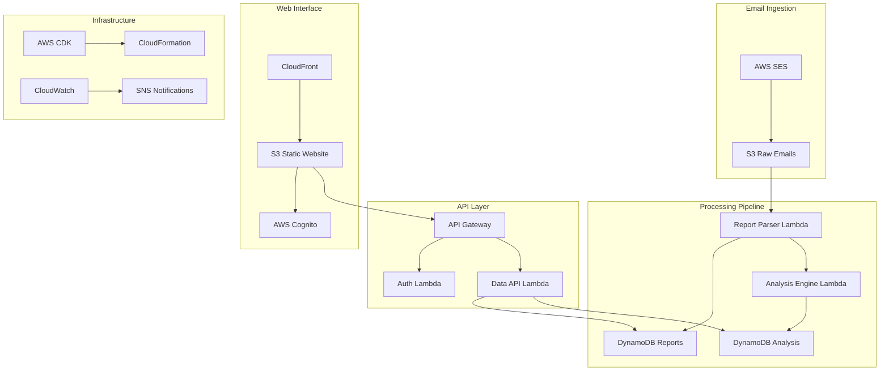

# Design Document: DMARC Lens

## Overview

DMARC Lens is a serverless, AWS-native platform for analyzing DMARC (Domain-based Message Authentication, Reporting & Conformance) email security reports. The system provides automated ingestion, processing, and visualization of DMARC aggregate reports to help organizations understand their email authentication posture and identify security issues.

The platform follows a fully serverless architecture using AWS managed services, ensuring scalability, cost-effectiveness, and minimal operational overhead.

## Architecture



## Components and Interfaces

### Email Ingestion Layer

**AWS SES Configuration**
- Receives DMARC aggregate reports via configured email addresses
- Stores raw emails in S3 bucket with organized folder structure
- Triggers Lambda processing via S3 event notifications

**S3 Raw Email Storage**
- Bucket structure: `/{year}/{month}/{day}/{sender-domain}/{timestamp}-{message-id}.eml`
- Lifecycle policies for cost optimization
- Server-side encryption with AWS KMS

### Processing Pipeline

**Report Parser Lambda**
- **Runtime**: Python 3.11
- **Memory**: 512MB (adjustable based on report sizes)
- **Timeout**: 5 minutes
- **Triggers**: S3 PUT events from SES email delivery
- **Functions**:
  - Extract XML attachments from email messages
  - Parse DMARC aggregate report XML using Python `xml.etree.ElementTree`
  - Validate report structure against DMARC schema
  - Store structured data in DynamoDB

**Analysis Engine Lambda**
- **Runtime**: Python 3.11
- **Memory**: 256MB
- **Timeout**: 2 minutes
- **Triggers**: DynamoDB Streams from Reports table
- **Functions**:
  - Calculate authentication success/failure rates
  - Identify trending patterns and anomalies
  - Generate security insights and recommendations
  - Store analysis results in separate DynamoDB table

### Data Layer

**DynamoDB Reports Table**
- **Partition Key**: `report_id` (string) - Unique identifier for each report
- **Sort Key**: `record_id` (string) - Individual record within report
- **Attributes**:
  - `org_name` (string) - Reporting organization
  - `email` (string) - Contact email
  - `report_id` (string) - Report identifier
  - `date_range_begin` (number) - Unix timestamp
  - `date_range_end` (number) - Unix timestamp
  - `domain` (string) - Domain being reported on
  - `source_ip` (string) - Source IP address
  - `count` (number) - Message count
  - `disposition` (string) - DMARC disposition (none/quarantine/reject)
  - `dkim_result` (string) - DKIM alignment result (pass/fail)
  - `spf_result` (string) - SPF alignment result (pass/fail)
  - `header_from` (string) - Header From domain
  - `created_at` (number) - Processing timestamp

**DynamoDB Analysis Table**
- **Partition Key**: `domain` (string) - Domain being analyzed
- **Sort Key**: `analysis_date` (string) - Date of analysis (YYYY-MM-DD)
- **Attributes**:
  - `total_messages` (number) - Total message count
  - `auth_success_rate` (number) - Authentication success percentage
  - `top_sources` (list) - Top source IPs by volume
  - `failure_reasons` (map) - Categorized failure reasons
  - `recommendations` (list) - Security recommendations
  - `trend_data` (map) - Historical trend information

### API Layer

**API Gateway HTTP API**
- RESTful endpoints for data access
- JWT token validation using Cognito
- Rate limiting and throttling
- CORS configuration for web interface

**Authentication Lambda**
- Validates JWT tokens from Cognito
- Implements authorization logic
- Returns user context for API requests

**Data API Lambda**
- **Runtime**: Python 3.11
- **Memory**: 256MB
- **Endpoints**:
  - `GET /reports` - List DMARC reports with filtering
  - `GET /reports/{report_id}` - Get specific report details
  - `GET /analysis/{domain}` - Get domain analysis data
  - `GET /dashboard` - Get dashboard summary data

### Web Interface

**React Single Page Application**
- **Framework**: React 18 with TypeScript
- **State Management**: React Query for server state
- **UI Library**: Material-UI or Chakra UI
- **Charts**: Recharts or Chart.js for visualizations
- **Authentication**: AWS Amplify Auth integration

**Key Components**:
- Dashboard with summary metrics
- Report listing and detail views
- Interactive charts and graphs
- Domain-specific analysis views
- User authentication flows

**CloudFront Distribution**
- Global content delivery
- HTTPS termination
- Caching optimization for static assets
- Custom error pages

## Data Models

### DMARC Report XML Structure
```xml
<feedback>
  <report_metadata>
    <org_name>Example Corp</org_name>
    <email>dmarc@example.com</email>
    <report_id>12345</report_id>
    <date_range>
      <begin>1609459200</begin>
      <end>1609545600</end>
    </date_range>
  </report_metadata>
  <policy_published>
    <domain>example.org</domain>
    <p>quarantine</p>
    <sp>none</sp>
    <pct>100</pct>
  </policy_published>
  <record>
    <row>
      <source_ip>192.0.2.1</source_ip>
      <count>12</count>
      <policy_evaluated>
        <disposition>none</disposition>
        <dkim>pass</dkim>
        <spf>pass</spf>
      </policy_evaluated>
    </row>
    <identifiers>
      <header_from>example.org</header_from>
    </identifiers>
    <auth_results>
      <dkim>
        <domain>example.org</domain>
        <result>pass</result>
      </dkim>
      <spf>
        <domain>example.org</domain>
        <result>pass</result>
      </spf>
    </auth_results>
  </record>
</feedback>
```

### Python Data Classes
```python
from dataclasses import dataclass
from typing import List, Optional
from datetime import datetime

@dataclass
class ReportMetadata:
    org_name: str
    email: str
    report_id: str
    date_range_begin: datetime
    date_range_end: datetime

@dataclass
class PolicyPublished:
    domain: str
    p: str  # none, quarantine, reject
    sp: Optional[str]
    pct: int

@dataclass
class PolicyEvaluated:
    disposition: str  # none, quarantine, reject
    dkim: str  # pass, fail
    spf: str  # pass, fail

@dataclass
class AuthResult:
    domain: str
    result: str  # pass, fail

@dataclass
class DMARCRecord:
    source_ip: str
    count: int
    policy_evaluated: PolicyEvaluated
    header_from: str
    dkim_results: List[AuthResult]
    spf_results: List[AuthResult]

@dataclass
class DMARCReport:
    metadata: ReportMetadata
    policy_published: PolicyPublished
    records: List[DMARCRecord]
```

## Correctness Properties

*A property is a characteristic or behavior that should hold true across all valid executions of a system—essentially, a formal statement about what the system should do. Properties serve as the bridge between human-readable specifications and machine-verifiable correctness guarantees.*

### Property Reflection

After analyzing all acceptance criteria, I identified several areas where properties can be consolidated:
- Email storage and organization properties can be combined into comprehensive storage verification
- Parser validation and data storage can be unified into parsing round-trip properties
- Authentication and authorization properties can be consolidated into comprehensive security properties
- API response and error handling can be combined into API contract properties

### Core Properties

**Property 1: Email Storage and Organization**
*For any* DMARC report email sent to SES, the system should store it in S3 with the correct path structure (/{year}/{month}/{day}/{sender-domain}/) and trigger the parser Lambda function
**Validates: Requirements 1.1, 1.2, 1.3**

**Property 2: Attachment Preservation**
*For any* email with DMARC report attachments, all attachments should be preserved and accessible after storage
**Validates: Requirements 1.4**

**Property 3: DMARC Report Parsing Round-Trip**
*For any* valid DMARC XML report, parsing then extracting the data should preserve all essential report information (metadata, policy, and records)
**Validates: Requirements 2.1, 2.2, 2.3, 2.5**

**Property 4: Parser Error Handling**
*For any* malformed or invalid DMARC report, the parser should log appropriate errors and store the failed report without crashing
**Validates: Requirements 2.4**

**Property 5: Authentication Success Rate Calculation**
*For any* set of DMARC records for a domain, the calculated authentication success rate should equal the percentage of records where both DKIM and SPF align and pass
**Validates: Requirements 3.1**

**Property 6: Analysis Data Completeness**
*For any* completed analysis, the stored results should include all required fields: success rates, failure sources, trends, and recommendations
**Validates: Requirements 3.2, 3.3, 3.4**

**Property 7: Security Issue Detection**
*For any* analysis data containing known suspicious patterns (high failure rates, unusual source IPs, policy violations), the system should flag appropriate security issues
**Validates: Requirements 3.5**

**Property 8: Authentication and Authorization**
*For any* request to protected resources, access should be granted if and only if a valid JWT token from Cognito is provided
**Validates: Requirements 4.1, 4.2, 4.3, 4.4, 4.5**

**Property 9: Web Interface Data Display**
*For any* dashboard or report view, all required data elements (summary metrics, success rates, source IPs, authentication results) should be present and correctly formatted
**Validates: Requirements 5.1, 5.2, 5.5**

**Property 10: Interactive Filtering**
*For any* time period or filter selection in the web interface, the displayed data should be accurately filtered to match the selection criteria
**Validates: Requirements 5.4**

**Property 11: API Response Format**
*For any* authenticated API request, the response should be valid JSON containing the requested DMARC data with proper structure and formatting
**Validates: Requirements 6.1**

**Property 12: Query Filtering and Pagination**
*For any* API query with filters (date range, domain, report type), the results should include only matching records and be properly paginated when the result set is large
**Validates: Requirements 6.2, 6.4**

**Property 13: Rate Limiting**
*For any* sequence of API requests exceeding the configured rate limit, subsequent requests should be rejected with appropriate HTTP status codes
**Validates: Requirements 6.3**

**Property 14: API Error Handling**
*For any* API error condition, the response should include descriptive error messages and appropriate HTTP status codes (4xx for client errors, 5xx for server errors)
**Validates: Requirements 6.5**

**Property 15: System Observability**
*For any* system operation, appropriate CloudWatch metrics and logs should be generated, and error conditions should trigger SNS notifications
**Validates: Requirements 7.4, 7.5**

## Error Handling

### Email Processing Errors
- **Invalid Email Format**: Log error, store email in quarantine bucket for manual review
- **Missing Attachments**: Process email metadata, flag as incomplete report
- **Large Email Size**: Use S3 multipart upload, implement streaming processing

### XML Parsing Errors
- **Malformed XML**: Log parsing error with line numbers, store in failed reports table
- **Schema Validation Failures**: Log validation errors, attempt partial parsing for recoverable data
- **Encoding Issues**: Attempt multiple encoding detection methods, log character set issues

### DynamoDB Errors
- **Throttling**: Implement exponential backoff with jitter
- **Item Size Limits**: Split large reports into multiple records
- **Conditional Write Failures**: Implement idempotency keys to handle duplicates

### Lambda Function Errors
- **Timeout**: Implement checkpointing for long-running operations
- **Memory Limits**: Monitor memory usage, implement streaming for large files
- **Cold Start**: Use provisioned concurrency for critical functions

### API Errors
- **Authentication Failures**: Return 401 with clear error messages
- **Authorization Failures**: Return 403 with minimal information to prevent enumeration
- **Rate Limiting**: Return 429 with Retry-After headers
- **Validation Errors**: Return 400 with detailed field-level error information

## Testing Strategy

### Dual Testing Approach
The system will use both unit testing and property-based testing to ensure comprehensive coverage:

**Unit Tests**: Verify specific examples, edge cases, and error conditions
- Test specific DMARC report formats and edge cases
- Verify error handling with known failure scenarios
- Test integration points between AWS services
- Validate UI components with specific data sets

**Property Tests**: Verify universal properties across all inputs
- Use Hypothesis (Python) for property-based testing
- Generate random DMARC reports and verify parsing consistency
- Test authentication flows with various token states
- Validate API responses across different query parameters

### Property-Based Testing Configuration
- **Library**: Hypothesis for Python Lambda functions, fast-check for TypeScript frontend
- **Iterations**: Minimum 100 iterations per property test
- **Test Tags**: Each property test must reference its design document property
- **Tag Format**: **Feature: dmarc-analysis, Property {number}: {property_text}**

### Testing Infrastructure
- **Unit Tests**: pytest for Python components, Jest for React components
- **Integration Tests**: AWS SAM local for Lambda testing, Testcontainers for DynamoDB
- **End-to-End Tests**: Playwright for web interface testing
- **Load Testing**: Artillery.js for API performance testing

### Test Data Management
- **Synthetic DMARC Reports**: Generate valid XML reports with various patterns
- **Test Fixtures**: Maintain library of real-world (anonymized) DMARC reports
- **Mock Services**: Use moto for AWS service mocking in unit tests
- **Test Isolation**: Each test should create and clean up its own data

The testing strategy ensures that both concrete examples work correctly (unit tests) and that the system behaves correctly across all possible inputs (property tests), providing comprehensive validation of the DMARC Lens platform.